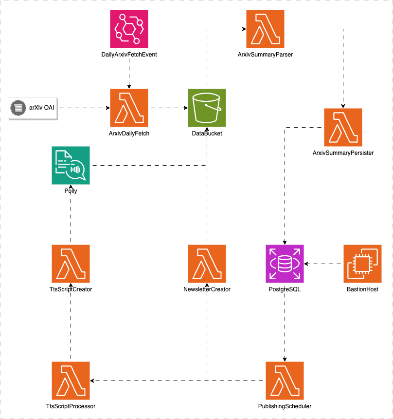

# aws-iac

Infrastructure as code for AtomikLabs

AtomikLabs is an open science platform. Currently it supports sharing the latest research in AI to promote collaboration and accelerate the pace of research through automated podcast and newsletter generation. In future it will support a range of tools to help researchers accelerate their research.

# Overview

AtomikLabs uses a serverless event-driven microservices architecture. All of the infrastructure is deployed on AWS using nested CloudFormation templates and GitHub Actions. There are four environments; test, dev, stage, and prod. Test is stood up and torn down when PRs for infrastructure as code are made to dev. The other environments are deployed or updated when code is merged into them.

The infrastructure is written as a series of nested CloudFormation templates. The templates are written in YAML and are stored in the `templates` directory. The GitHub Actions workflow is defined in `.github/workflows/iac-ci-cd.yml`.

# Phase 1 Infrastructure Diagram

Phase 1 supports the initial podcasts and newsletters. It is a simple architecture that uses a single AWS account.

# Additional Phases

Phase 2 will add infrastructure to support automated podcast and newsletter publishing. Latter phases will add NLP and ML tools to support researchers.
